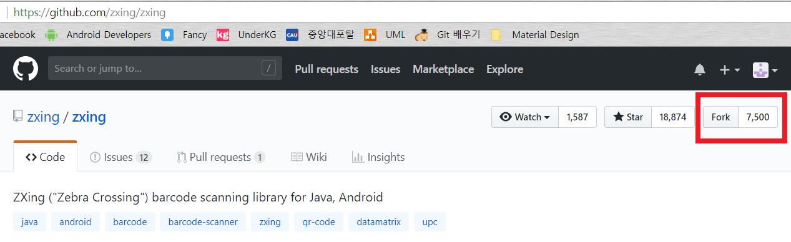
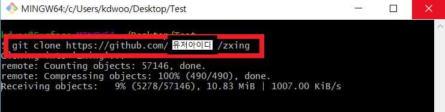
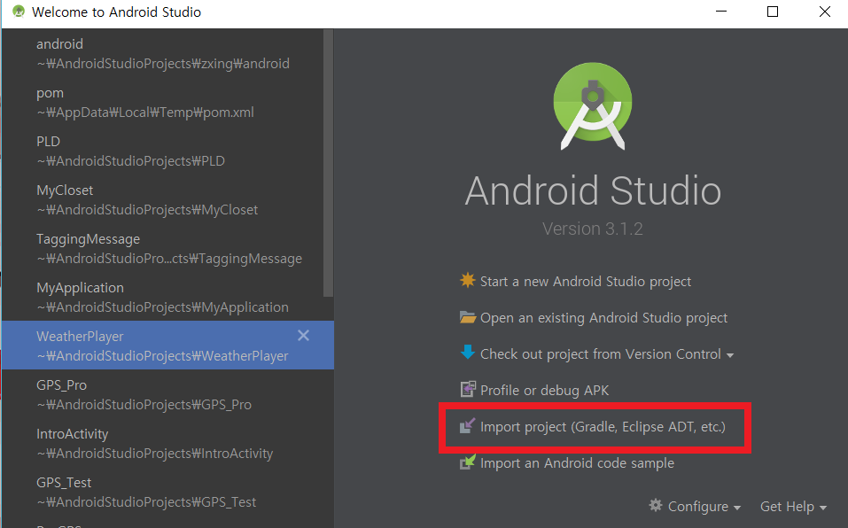
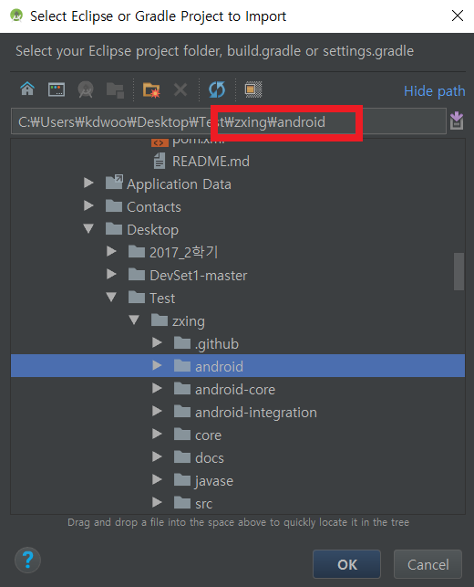
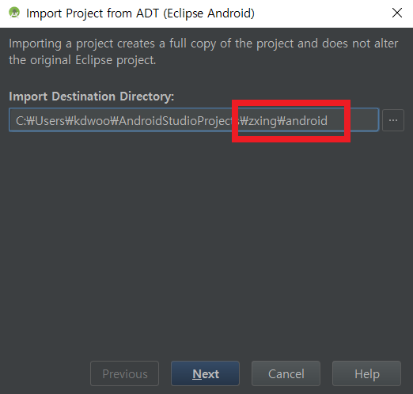
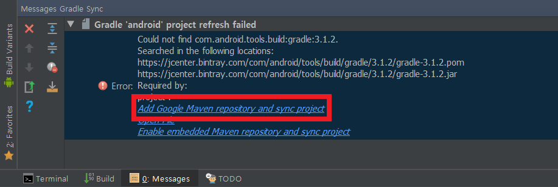
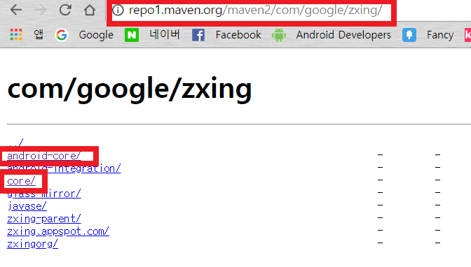
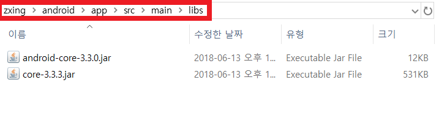
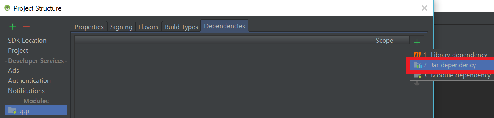
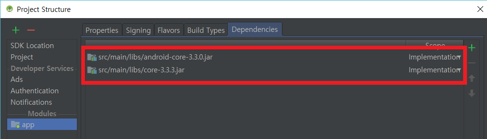

 # Zxing 안드로이드 Build 하기

 Zxing에서 제공하는 바코드 스캐너 어플리케이션을 Android Studio에서 Build 하는 방법을 설명합니다.

 <h2>1. 소스코드 다운받기</h2>

 <h3> Git Fork </h3>

  
  >Zxing/Zxing 리파지토리를 자신의 리파지토리로 복사합니다.

  <h3> Git Clone</h3>

  
  >다운받을 폴더에서 Git Bash를 실행하고 git clone을 통하여 복사한 리파지토리를 다운받습니다.
  예) git clone https://github.com/유저아이디/zxing.git

<h2>2. Android Studio 프로젝트 생성</h2>

  <h3> Import project </h3>

  
  >우측 탭들 중 Import project (Gradle, Eclipse, ADT, etc.)를 선택합니다.

  
  >다운받은 파일 경로지에 android 폴더를 선택합니다. (.../zxing/android)

  
  >주의!! 해당 폴더를 선택하면 폴더 경로가 ...\zxing\android1 이라고 입력되는데 ...\zxing\android 로 수정합니다.

  
  >다음과 같은 화면이 표시되면 모든 항목을 체크하고 Finish 버튼을 선택합니다.

 <h3>3. Project 설정</h3>

 예제를 통하여 JUnit 사용법을 알아보도록 하겠습니다.
 이번에 사용될 예제는 계산기 예제로 이를 통해 JUnit을 사용해 볼 것입니다.

 <h3> 테스트 클래스 생성 및 메소드 정의</h3>

  
  >경고창 하단의 "Add Google Maven repository and sync project" 문구를 선택합니다.

  
  >repo1.maven.org/maven2/com/google/zxing/ 으로 접속하여 android-core/와 core/ 폴더의 .jar 파일을 다운받습니다. (android-core-X.X.X.jar, core-X.X.X.jar)

  
  >.../zxing/android/app/src/main/libs 폴더로 다운받은 .jar 파일을 옮깁니다.
  (폴더가 없는경우 추가합니다.)

 <h3> Module 추가 </h3>

 
 >Android Studio의 좌측 파일 구조 중 app에 오른쪽 마우스를 클릭하여 Open Module Settings 를 선택합니다.

 
 >우측에 + 버튼을 눌러 2.Jar dependency를 선택하여 앞의 .jar 파일을 추가합니다.

